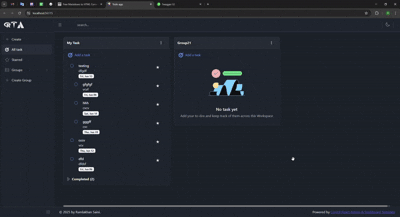

# ToDo Application

This is the main project repository for a modern **ToDo Application**. The project is organized into two main parts:

- **Frontend:** [`todoapp.client`](todoapp.client/README.md) — A React application built with Vite and CoreUI.
- **Backend:** [`ToDoApp.Server`](ToDoApp.Server/README.md) — An ASP.NET Core Web API backend.

## 📺 Project Demo

- **Full Project Overview:**  
   
   [Watch Preview](https://raw.githubusercontent.com/sumedha-softech/todo-app/feature/ramlakhan/doc/todo-app.mp4)

## Project Structure

```
ToDoApp/
├── ToDoApp.Server/       # ASP.NET Core backend (Web API)
│   ├── Controllers/
│   ├── Models/
│   ├── Services/
│   ├── Program.cs
│   ├── appsettings.json
│   └── ...               # Other backend-related files
│
├── todoapp.client/       # React frontend (Vite)
│   ├── public/
│   │   ├── manifest.json
│   │   └── vite.svg
│   ├── src/
│   │   ├── api/           # API calls for tasks, groups, and auth
│   │   ├── Components/    # All React components (AppSidebar, Dashboard, GroupCard, etc.)
│   │   ├── global/        # Context and helpers
│   │   ├── Hooks/         # Custom hooks (e.g., useTaskEvents)
│   │   ├── Layout/        # Layout components
│   │   ├── scss/          # SCSS styles (CoreUI, custom, vendors)
│   │   ├── _nav.jsx       # Sidebar navigation config
│   │   ├── App.jsx        # Main App component
│   │   ├── main.jsx       # Entry point
│   │   └── routes.jsx     # Route definitions
│   ├── index.html
│   ├── package.json
│   ├── vite.config.js
│   ├── eslint.config.js
│   └── README.md
│
├── Sql/                  # Database migration scripts
│   ├── 01-initial.sql
│   └── ...
│
├── ToDoApp.sln           # Visual Studio solution file
└── README.md             # Main project overview (this file)
```

## Overview

- **Frontend:**  
  The frontend is a single-page React application for managing tasks, groups, and starred items. It communicates with the backend via RESTful APIs.

- **Backend:**  
  The backend is an ASP.NET Core Web API that handles all data operations, authentication, and business logic for the ToDo app.

## Getting Started

### Prerequisites

- [.NET 8 SDK](https://dotnet.microsoft.com/download)
- [Node.js](https://nodejs.org/) (v18+ recommended)
- [npm](https://www.npmjs.com/)

### Setup

1. **Clone the repository:**
   ```sh
   git clone <your-repo-url>
   cd todo-app

2. **Set up the backend:**
   Navigate to **ToDoApp.Server** and follow the instructions to run the ASP.NET Core API.

3. **Set up the frontend:**
   Navigate to todoapp.client and follow the instructions to install dependencies and run the React app.

---

## License

This project is licensed under the MIT License.